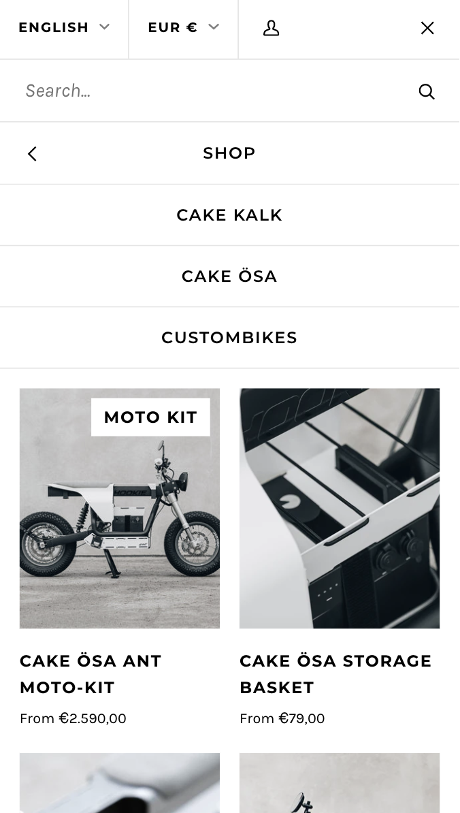

# Procesverslag
Markdown is een simpele manier om HTML te schrijven.  
Markdown cheat cheet: [Hulp bij het schrijven van Markdown](https://github.com/adam-p/markdown-here/wiki/Markdown-Cheatsheet).

Nb. De standaardstructuur en de spartaanse opmaak van de README.md zijn helemaal prima. Het gaat om de inhoud van je procesverslag. Besteedt de tijd voor pracht en praal aan je website.

Nb. Door *open* toe te voegen aan een *details* element kun je deze standaard open zetten. Fijn om dat steeds voor de relevante stuk(ken) te doen.

## Jij

  
uitwerken voor kick-off werkgroep

  ### Auteur:
  Dan Naumann

  #### Je startniveau:
  blauw

  #### Je focus:
  Surface plane
 

## Je website

  
uitwerken voor kick-off werkgroep

  ### Je opdracht:
  https://hookie.co/

  #### Screenshot(s) van de eerste pagina (small screen): 
  hier de naam van de pagina  
  

  #### Screenshot(s) van de tweede pagina (small screen):
  hier de naam van de pagina  
  
 

## Toegankelijkheidstest 1/2 (week 1)

  
uitwerken na test in 1e werkgroep

  ### Bevindingen
Bij het gebruik van de screenreader viel het op dat er geen extra informatie is toegevoegd die de website toegankelijker maken voor gebruikers van screenreaders. De beschrijving is functioneel maar geeft niet veel extra details. Titels worden uitgelezen, maar er wordt geen extra informatie over de inhoud van afbeeldingen gegeven en knoppen zeggen weinig over hun bestemming.  Verder is de herarchie is onaanwezig of zodanig onduidelijk dat het niet heel behulpzaam is. Bij de productpagina is het bijna onmogelijk om van de titel van het gegeven product gemakkelijk naar de beschrijving te komen. Via de koppen kom niet naar de beschrijving, zie volgende afbeelding:

De beschrijving van het product zit achter 5-6 knop, die gebruiker nog apart moet openen om bij de informatie te komen. Dit kost nog extra stappen en zoekwerk, zie volgende afbeelding:

Hiernaast is navigeren bij het gebruik van een toetsen bord moeilijk, er lijkt geen duidelijker herarchie te zijn.

## Breakdownschets (week 1)

  
uitwerken na afloop 2e werkgroep

  

## Voortgang 1 (week 2)

  
uitwerken voor 1e voortgang

  ### Stand van zaken Dan
  Ik vind het nog vrij moeilijk om overzicht te houden over de parents en de childs. Als ik helemaal nieuwe code schrijf dan lukt het me niet om het overzicht te houden omdat nog niet alle veranderingen te zien zijn. Het aanpassen van de opdrachten voor het gebruik van de website werkt wel maar ik vind het moeilijk om daar verder op te borduren. Hierdoor bleef ik heel erg vast zitten met het schrijven van de HTML.

  https://codepen.io/DanNaumannHvA/pen/eYbyVRN

  ### Stand van zaken Laura
  Mijn HTML code is redelijk uitgebereid en ik heb zelfs al CSS toegepast.
  Ik loop echter met simpele zaken nog een beetje vast (lees: ik heb dit gewoon nog niet correct toegepast), maar ik heb nog niet de tijd genomen om hier goed voor te zitten en hierover te Googlen. Wanneer ik écht vast loop zal ik vragen stellen. 

  

  ### Agenda voor meeting
  samen met je groepje opstellen

  - Vragen over het gebruik van afbeeldingen: Moet dit in de CSS of mag dit in de HTML.
  - Hoeveel delen/sections moet je minimaal hebben van de website.

  ### Verslag van meeting
  hier na afloop snel de uitkomsten van de meeting vastleggen

  - punt 1
  - punt 2
  - nog een punt
  - ...

## Voortgang 2 (week 3)

  
uitwerken voor 2e voortgang

  ### Stand van zaken
  Ik begin het eindelijk een beetje te begrijpen maar het is moeilijk overzicht te houden met zoveel selectors in de CSS. Heb nu wel een goed begin en een ritme gevonden die ik kan begrijpen. 

  ### Agenda voor meeting
  - Is de HTML zo semantisch goed? 
  - Is er een maximaal aantal aan selectoren?
  - Kun je . , > + symbolen ook aan elkaar koppelen? en zo ja, hoe moet dit dan?
  - Wanneer mag je wel een class gebruiken?      |

  ### Verslag van meeting
  hier na afloop snel de uitkomsten van de meeting vastleggen

  - punt 1
  - punt 2
  - nog een punt
- ...

## Toegankelijkheidstest 2/2 (week 4)

  
uitwerken na test in 8e werkgroep

  ### Bevindingen
  Lijst met je bevindingen die in de test naar voren kwamen (geef ook aan wat er verbeterd is):

  #### Screenreader
  Hier korte omschrijving (met indien nodig afbeeldingen)

  Hier een omschrijving van hoe het opgelost kan worden (met indien nodig afbeeldingen)

  #### Muis en Toetsenbord 
  Hier korte omschrijving (met indien nodig afbeeldingen)

  Hier een omschrijving van hoe het opgelost kan worden (met indien nodig afbeeldingen)

  #### Motoriek (shocks, elastiekjes)
  Hier korte omschrijving (met indien nodig afbeeldingen)

  Hier een omschrijving van hoe het opgelost kan worden (met indien nodig afbeeldingen)

  #### Visueel (brillen, contrast, kleurenblind, dark/light). 
  Hier korte omschrijving (met indien nodig afbeeldingen)

  Hier een omschrijving van hoe het opgelost kan worden (met indien nodig afbeeldingen)

## Voortgang 3 (week 4)

  
uitwerken voor 3e voortgang

  ### Stand van zaken
  hier dit ging goed & dit was lastig (neem ook screenshots op van delen van je website en code)

  ### Agenda voor meeting
  samen met je groepje opstellen

  | student 1      | student 2          | student 3    | student 4        |
  | ---            | ---                | ---          | ---              |
  | dit bespreken  | en dit             | en ik dit    | en dan ik dat    |
  | en dat ook nog | dit als er tijd is | nog een punt | dit wil ik zeker |
  | ...            | ...                | ...          | ...              |

  ### Verslag van meeting
  hier na afloop snel de uitkomsten van de meeting vastleggen

  - punt 1
  - punt 2
  - nog een punt
  - ...

## Eindgesprek (week 5)

  
uitwerken voor eindgesprek

  ### Je uitkomst - karakteristiek screenshots:
  

  ### Dit ging goed/Heb ik geleerd: 
  Korte omschrijving met plaatjes

  

  ### Dit was lastig/Is niet gelukt:
  Korte omschrijving met plaatjes

  

## Bronnenlijst

  
continu bijhouden terwijl je werkt

  Nb. Wees specifiek ('css-tricks' als bron is bijv. niet specifiek genoeg).

  1. bron 1
  2. bron 2
  3. ...

