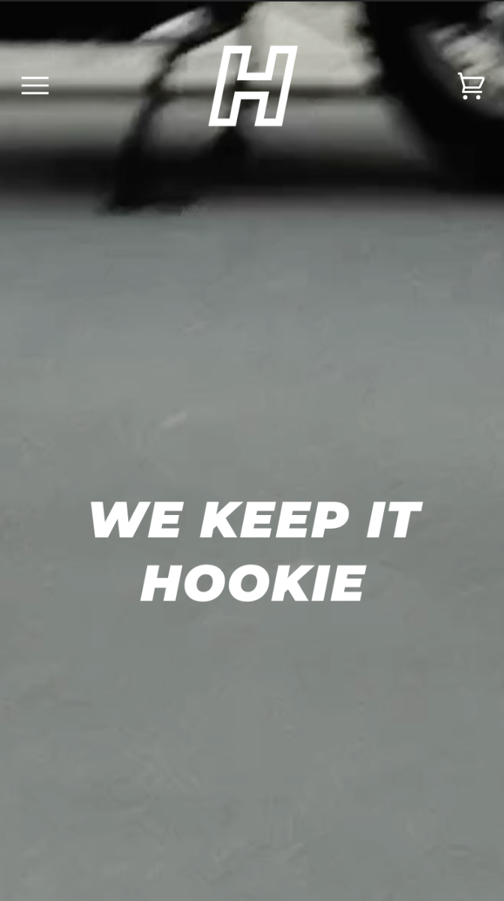
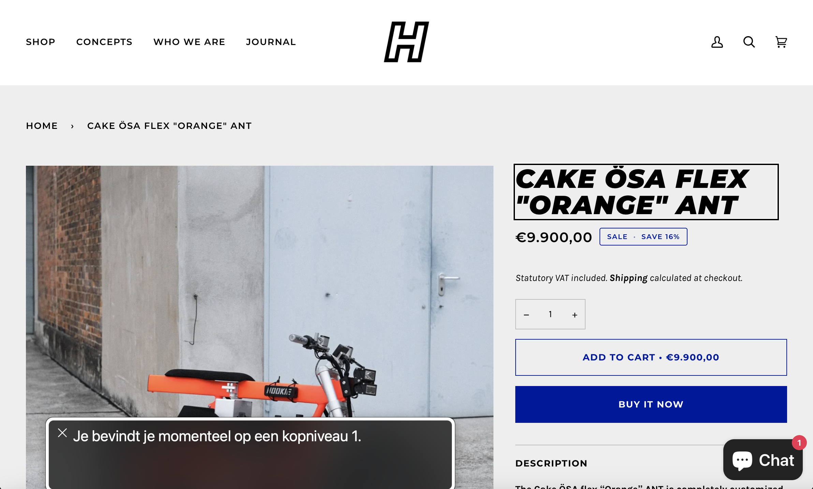
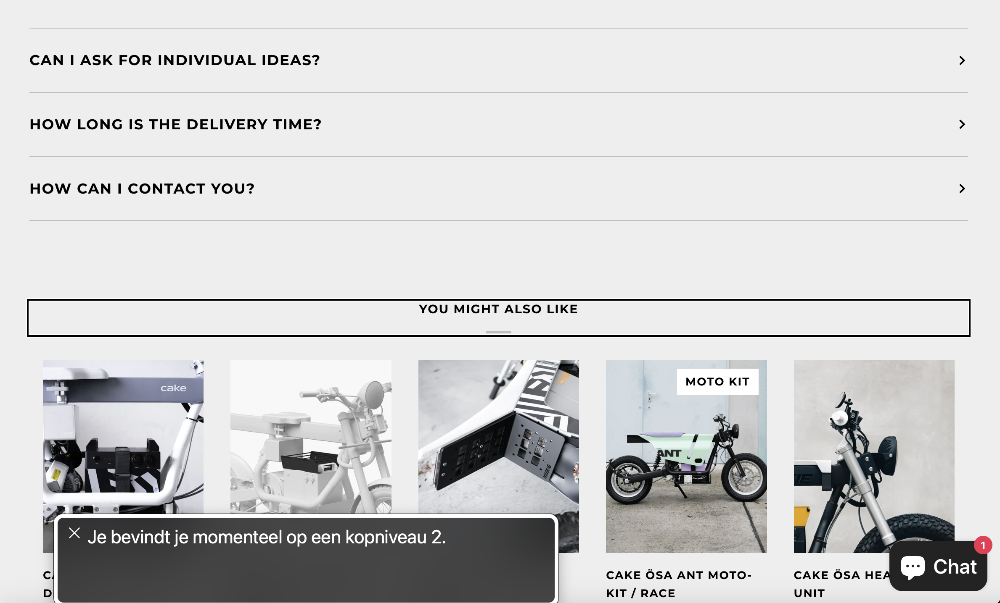
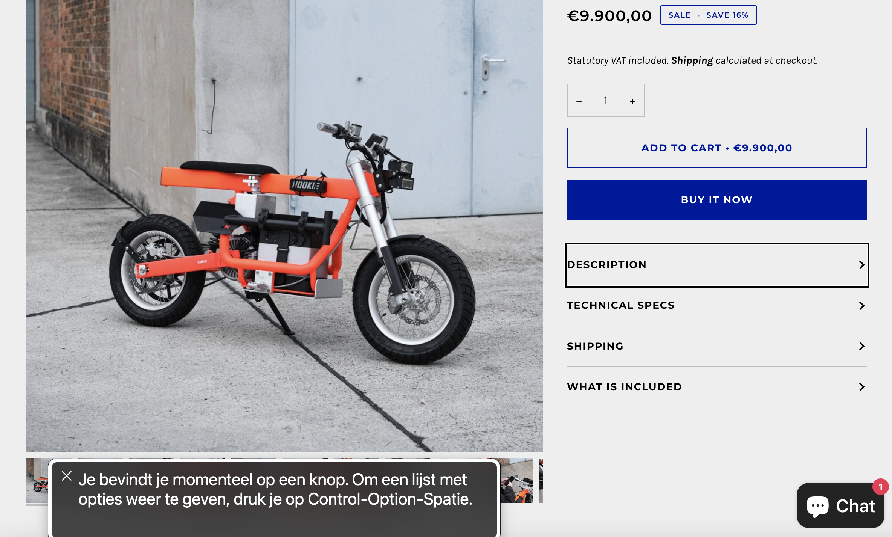
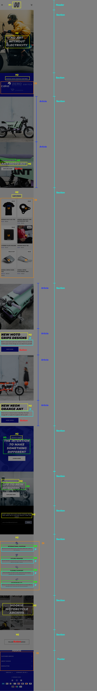
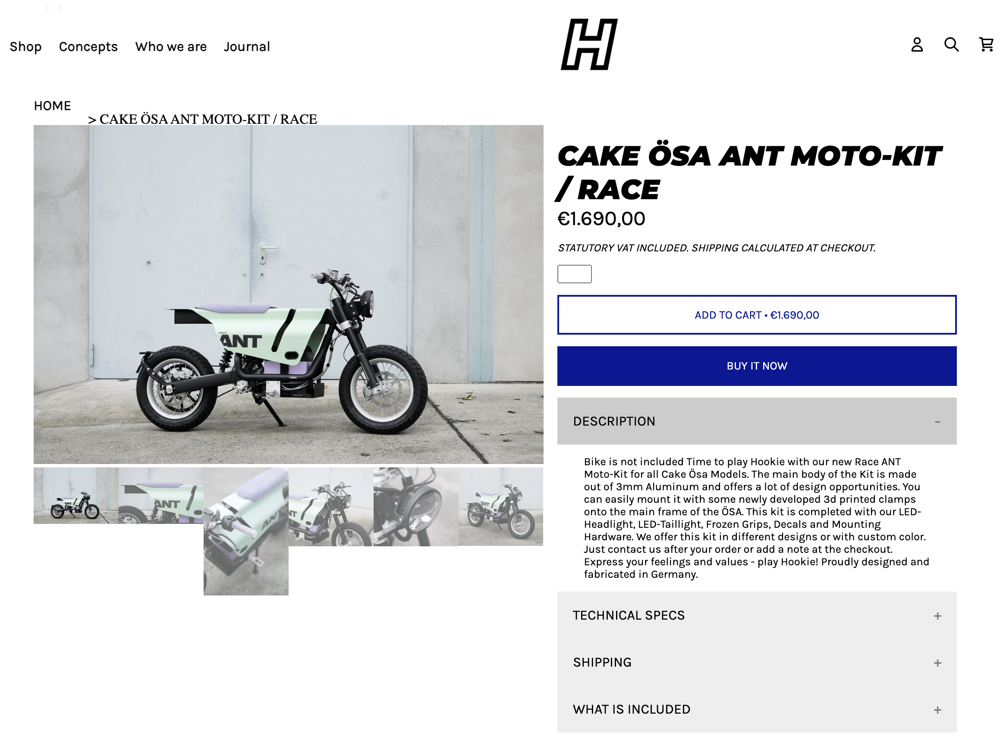
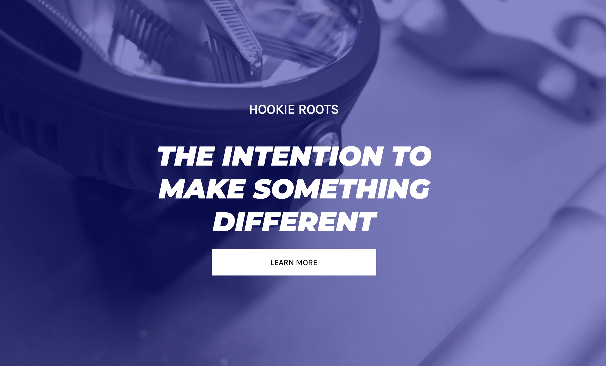
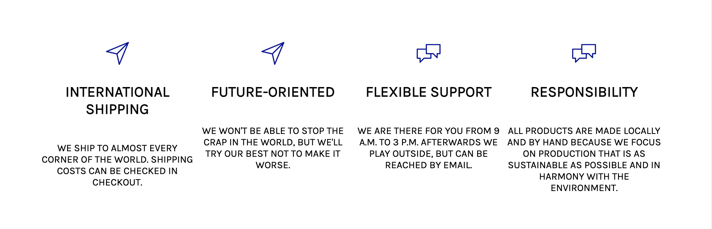

# Procesverslag
Markdown is een simpele manier om HTML te schrijven.  
Markdown cheat cheet: [Hulp bij het schrijven van Markdown](https://github.com/adam-p/markdown-here/wiki/Markdown-Cheatsheet).

Nb. De standaardstructuur en de spartaanse opmaak van de README.md zijn helemaal prima. Het gaat om de inhoud van je procesverslag. Besteedt de tijd voor pracht en praal aan je website.

Nb. Door *open* toe te voegen aan een *details* element kun je deze standaard open zetten. Fijn om dat steeds voor de relevante stuk(ken) te doen.

## Jij

  
uitwerken voor kick-off werkgroep

  ### Auteur:
  Dan Naumann

  #### Je startniveau:
  blauw

  #### Je focus:
  Surface plane
 

## Je website

  
uitwerken voor kick-off werkgroep

  ### Je opdracht:
  https://hookie.co/

  #### Screenshot(s) van de eerste pagina (small screen): 
  hier de naam van de pagina  
  

  #### Screenshot(s) van de tweede pagina (small screen):
  hier de naam van de pagina  
  
 

## Toegankelijkheidstest 1/2 (week 1)

  
uitwerken na test in 1e werkgroep

  ### Bevindingen
Bij het gebruik van de screenreader viel het op dat er geen extra informatie is toegevoegd die de website toegankelijker maken voor gebruikers van screenreaders. De beschrijving is functioneel maar geeft niet veel extra details. Titels worden uitgelezen, maar er wordt geen extra informatie over de inhoud van afbeeldingen gegeven en knoppen zeggen weinig over hun bestemming.  Verder is de herarchie is onaanwezig of zodanig onduidelijk dat het niet heel behulpzaam is. Bij de productpagina is het bijna onmogelijk om van de titel van het gegeven product gemakkelijk naar de beschrijving te komen. Via de koppen kom niet naar de beschrijving, zie volgende afbeelding:

De beschrijving van het product zit achter 5-6 knop, die gebruiker nog apart moet openen om bij de informatie te komen. Dit kost nog extra stappen en zoekwerk, zie volgende afbeelding:

Hiernaast is navigeren bij het gebruik van een toetsen bord moeilijk, er lijkt geen duidelijker herarchie te zijn.

## Breakdownschets (week 1)

  
uitwerken na afloop 2e werkgroep

  

## Voortgang 1 (week 2)

  
uitwerken voor 1e voortgang

  ### Stand van zaken Dan
  Ik vind het nog vrij moeilijk om overzicht te houden over de parents en de childs. Als ik helemaal nieuwe code schrijf dan lukt het me niet om het overzicht te houden omdat nog niet alle veranderingen te zien zijn. Het aanpassen van de opdrachten voor het gebruik van de website werkt wel maar ik vind het moeilijk om daar verder op te borduren. Hierdoor bleef ik heel erg vast zitten met het schrijven van de HTML.

  https://codepen.io/DanNaumannHvA/pen/eYbyVRN

  ### Stand van zaken Laura
  Mijn HTML code is redelijk uitgebereid en ik heb zelfs al CSS toegepast.
  Ik loop echter met simpele zaken nog een beetje vast (lees: ik heb dit gewoon nog niet correct toegepast), maar ik heb nog niet de tijd genomen om hier goed voor te zitten en hierover te Googlen. Wanneer ik écht vast loop zal ik vragen stellen. 

  

  ### Agenda voor meeting
  samen met je groepje opstellen

  - Vragen over het gebruik van afbeeldingen: Moet dit in de CSS of mag dit in de HTML.
  - Hoeveel delen/sections moet je minimaal hebben van de website.

  ### Verslag van meeting
 Laura deed het heel goed en ik heb voor zover alle HTML kunnen schrijven. Er zitten nog wat foutjes in kwa semantiek. Vooral bij de articles en sections

## Voortgang 2 (week 3)

  
uitwerken voor 2e voortgang

  ### Stand van zaken
Het begint eindelijk een beetje te klikken CSS, ondanks die oneindige selectors die soms nog voor wat verwarring zorgen. Gelukkig heb ik nu wel een goede start en een soort van ritme gevonden dat ik kan volgen. Het is nog steeds een uitdaging, maar ik blijf doorgaan, oefenen en proberen, en ik begin eindelijk een beetje te snappen hoe dit alles werkt.

  ### Agenda voor meeting
  - Is de HTML zo semantisch goed? 
  - Is er een maximaal aantal aan selectoren?
  - Kun je . , > + symbolen ook aan elkaar koppelen? en zo ja, hoe moet dit dan?
  - Wanneer mag je wel een class gebruiken?      |

  ### Verslag van meeting
 Iedereens website begint op een website te lijken. Er was weer wat verwarring met de semantiek het gebruik van articles en sections was verward de vorige meeting. Ik moet dit opnieuw doen.

## Toegankelijkheidstest 2/2 (week 4)

  
uitwerken na test in 8e werkgroep

  ### Bevindingen

  #### Screenreader
De screenreader kon ook niet de structuur en de navigatie van de website duidelijk maken, omdat er geen duidelijke koppen, lijsten, links en knoppen waren. Dit maakte het moeilijk voor mensen met een visuele beperking om de website te verkennen en te gebruiken.

De screenreader kon niet alle teksten op de website voorlezen, omdat sommige teksten in afbeeldingen of video’s waren verwerkt. 

  #### Muis en Toetsenbord 
De website had ook geen duidelijke focus of feedback bij het gebruik van een muis of een toetsenbord, omdat sommige elementen geen rand, kleur of animatie hadden om aan te geven dat ze geselecteerd of geactiveerd waren. 

  #### Motoriek (shocks, elastiekjes)
De website was niet goed te gebruiken met schokken of elastiekjes, omdat sommige elementen te klein, te dicht bij elkaar of te gevoelig waren. 

  #### Visueel (brillen, contrast, kleurenblind, dark/light). 
De website had ook geen optie om het contrast, de kleuren of de modus van de website aan te passen.

## Voortgang 3 (week 4)

  
uitwerken voor 3e voortgang

  ### Stand van zaken
  In door de deadlines deze en eind vorige week heb ik niet veel tijd kunnen besteden aan het verder ontwikkelen van de site. Alleen de sections zijn nu juist
  https://codepen.io/DanNaumannHvA/pen/eYxOJYa

  ### Agenda voor meeting (Vragen van groepje)
- Is het mogelijk om de buttons van de eerste foto's elke keer onderaan de ul te zetten ipv van de li? Zo is het lelijik
- Hoe krijg ik bij de tweede ul dat de de li smaller en langer worden totdat het scherm 749px is en dat ze dan onder elkaar komen. Dat tweede gedeelte lukt wel. Alleen nu blijven de li een bepaalde grootte waardoor ze over 2 rijen verdeeld worden ipv dat ze kleiner worden.

### Verslag van meeting

Iedereen deed het goed en er waren niet veel extra vragen.

## Eindgesprek (week 5)

  
uitwerken voor eindgesprek

  ### Je uitkomst - karakteristiek screenshots:
  

  ### Dit ging goed/Heb ik geleerd: 
  Ondanks de website niet af is heb ik wel meer geleerd over handig coderen. Ik ben een stuk handiger geworden met fouten vinden en ongewenste veranderingen teruglopen in de Inspector. Hiermnaast ben een een stuk bekender geworden met W3 Schools en vooral alle how-to's hebben heel erg geholpen. Uiteindelijk waren de animaties minder moeilijk dan ik dacht in vergelijking met de selectoren. Bij de selectoren ben ik heel blij dat ik uiteindelijk een manier had gevonden om de tweede pagina op te maken in het CSS bestand. Dit ging heel moeilijk op het begin, maar uiteindelijk kreeg ik het wel door waardoor er in ieder geval een helft van de tweede pagina er in grote lijnen staat met animaties. Hiernaast was een blauwe tint over een van de sections doen nog best een uitdaging, uiteindelijk had een klasgenoot me hiermee kunnen helpen wat ook heel veel hielp bij de selectoren uitvogelen. Het werken met SVG's was ook nog een kleine uitdaging om te verwerken, maar die uiteindelijk wel was geluk. Het was iets dat niet echt op de agenda stond, maar het was leuk om ineens uitgevogeld te hebben. 

  
  
  

  ### Dit was lastig/Is niet gelukt:
  Uiteindelijk was het jammer dat ik de tweede pagina niet af had gekregen. Het is nog steeds moeilijk om goed de selectoren op te zetten. Vaak codeerde ik mezelf in een hoe, en aanpassingen maken zorgde vaak voor verwarring. Uiteindelijk is de 5e versie van de website. Dus ik vind het vooral jammer dat ik nog niet goed een structuur kan uitbouwen en uitdenken. Daarnaast vind ik het ook jammer dat ik niet aan toegangkelijkheid veel delen van de responsivesness was gekomen.

  

## Bronnenlijst

  
continu bijhouden terwijl je werkt

  Nb. Wees specifiek ('css-tricks' als bron is bijv. niet specifiek genoeg).

  1. https://www.w3schools.com/cssref/css_selectors.php
  2. https://www.w3schools.com/cssref/trysel.php
  3. https://css-tricks.com/snippets/css/complete-guide-grid/
  4. https://css-tricks.com/snippets/css/a-guide-to-flexbox/
  5. https://www.w3schools.com/howto/default.asp
  6. https://www.w3schools.com/howto/howto_js_accordion.asp
  7. https://www.w3schools.com/css/css_image_gallery.asp
  8. https://www.w3schools.com/html/html5_semantic_elements.asp
  9. https://www.w3schools.com/tags/tag_input.asp
  10. https://www.w3schools.com/html/html_forms.asp
  11. https://www.w3schools.com/html/html5_svg.asp
  12. http://svgicons.sparkk.fr/
  13. https://www.w3schools.com/howto/howto_css_image_effects.asp
  14. https://www.w3schools.com/css/css_text.asp

